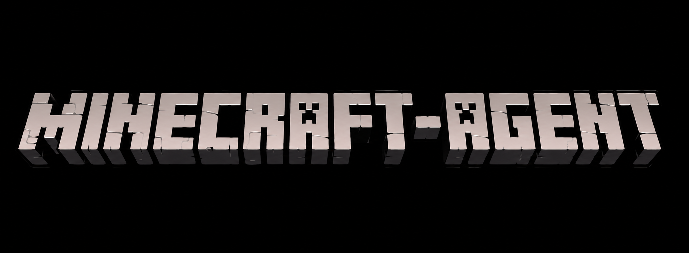

<p align="center">
  
</p>

<h1 align="center">Minecraft LLM Agent</h1>

An autonomous, LLM-driven Minecraft agent for **Java Edition**, built on
[Mineflayer](https://github.com/PrismarineJS/mineflayer). It connects to a server as a
player, perceives its surroundings, turns your chat into plans an LLM executes step by step,
and stays alive on its own with a fast, no-LLM survival reflex loop.

**What it can do today**
- Natural-language tasks over chat: *"collect 10 oak logs and craft a chest"*, *"come to me"*,
  *"go to 120 70 -340"*, *"build a 5x5 cobblestone hut"*.
- **Self-healing crafting** — pre-crafts missing ingredients, gathers raw materials, and
  finds/makes its own crafting table instead of giving up.
- **Reflex survival layer** (no LLM, ~6.7 Hz): auto-eat, flee creepers, self-defense — keeps
  the bot alive in the gap while the LLM is thinking.
- **Building mode** — a structural model the agent builds without a vision model
  (`fillArea`, `buildLine`, `inspectArea`, `buildStatus`).
- **Multi-provider LLM** — OpenAI, Claude, or Ollama (local or cloud), swappable in config.
- **Multi-agent** — run several bots that talk to and help each other over chat.
- **3D POV viewer**, **conversation memory**, optional **sandboxed code-gen** skills.

Architecture diagrams (high-level + low-level) live in
[`docs/diagrams/`](./docs/diagrams/).

## Demo

<p align="center">
  <video src="https://github.com/XnUnknown/Minecraft-Agent/raw/master/docs/assets/demo.mp4" controls muted width="720"></video>
</p>

▶️ The agent in action. If the player above doesn't load in your browser,
[open the demo video here](docs/assets/demo.mp4).

---

## 1. Prerequisites

| Need | Notes |
|---|---|
| **Node.js 20+** | LTS (20 or 22) recommended. Check with `node -v`. |
| **Git** | To clone the repo. |
| **A Minecraft Java server** | Running and reachable (localhost is fine). See [§3](#3-set-up-a-minecraft-java-server). **Server version must be ≤ 1.21.11** (see [Troubleshooting](#8-troubleshooting)). |
| **An LLM provider** | One of: an **Ollama** server (local or [ollama.com](https://ollama.com) cloud), an **OpenAI** API key, or an **Anthropic/Claude** API key. See [§4](#4-configure-the-llm-provider). |

> **Windows note:** this project pulls in `canvas`/`prismarine-viewer` (native modules). If
> `npm install` fails building them, install the build toolchain first
> (`npm install --global windows-build-tools`, or Visual Studio Build Tools with the
> "Desktop development with C++" workload + Python 3). On macOS/Linux a normal toolchain
> (Xcode CLT / build-essential) is enough.

---

## 2. Install

```bash
git clone https://github.com/XnUnknown/Minecraft-Agent.git
cd Minecraft-Agent
npm install            # also runs `patch-package` to apply bundled fixes (postinstall)
cp .env.example .env   # provider keys go here (see §4)
```

`npm install` automatically applies the patches in [`patches/`](./patches/) (small fixes to
`mineflayer` and `mineflayer-pathfinder`) via the `postinstall` hook — no manual step needed.

Verify it compiles:

```bash
npm run typecheck
```

---

## 3. Set up a Minecraft Java server

The agent is a client; you need a server for it to join.

1. Download a **vanilla** or **Paper** Java server (version **1.21.11 or older**) and run it
   once to generate its files.
2. For easy local testing, edit `server.properties`:
   ```properties
   online-mode=false      # lets the bot join without a Microsoft account ("offline" auth)
   ```
   *(Only do this on a private/local server. On an online-mode server you must use
   `auth: microsoft`, and Mineflayer will prompt a Microsoft device-code login on first run.)*
3. Start the server and make sure you can join it from your own Minecraft client.

> Want others to watch live? You can expose a localhost server to the internet with a tunnel
> like [playit.gg](https://playit.gg) — the agent still connects over `127.0.0.1`.

---

## 4. Configure the LLM provider

Two files control this:

### `config/providers.yaml` — *which* model, per role
Roles are `planner` (does the thinking) and `fast` (cheap summaries). Pick a provider per
role — **no code changes needed**. The default uses Ollama Cloud:

```yaml
roles:
  planner:
    provider: ollama        # openai | claude | ollama
    mode: cloud             # ollama only: local | cloud
    model: gemma4:31b
    toolCalling: json       # json for models without native tool-calling (e.g. Gemma); else native
    temperature: 0.4
    maxTokens: 2048
```

Common setups:

| You want… | Set in `providers.yaml` (planner) | Put in `.env` |
|---|---|---|
| **Ollama Cloud** (default) | `provider: ollama`, `mode: cloud`, `model: gemma4:31b`, `toolCalling: json` | `OLLAMA_API_KEY=...` (from ollama.com) |
| **Ollama local** | `provider: ollama`, `mode: local`, `model: <pulled model>` | *(nothing — run `ollama serve` locally)* |
| **OpenAI** | `provider: openai`, `model: gpt-4o` (or similar), `toolCalling: native` | `OPENAI_API_KEY=...` |
| **Claude** | `provider: claude`, `model: claude-opus-4-8` (or similar), `toolCalling: native` | `ANTHROPIC_API_KEY=...` |

### `.env` — your API keys
Only the key for the provider(s) you actually use is required:

```dotenv
OPENAI_API_KEY=
ANTHROPIC_API_KEY=
OLLAMA_API_KEY=
```

`.env` is git-ignored — your keys never get committed.

> The `embeddings` role in `providers.yaml` is for the future memory/RAG system and isn't
> called yet, so you don't need an embeddings key to run the agent.

---

## 5. Configure the agent & server connection

Edit `config/default.yaml`:

```yaml
server:
  host: 127.0.0.1      # your server's address
  port: 25565          # default Java port
  auth: offline        # "offline" (online-mode=false server) or "microsoft"
  version: ""          # "" = auto-detect; or pin e.g. "1.21.1" (must be <= 1.21.11)

agent:
  username: Steve_AI   # the bot's in-game name

conversation:
  maxMessages: 32      # compact chat history past this many messages
  keepRecent: 20       # keep this many verbatim after compaction

skills:
  codeExecution: false # true = let the model write & run sandboxed JS (runCode/saveSkill)

viewer:
  port: 3000           # 3D POV viewer port
```

---

## 6. Run

```bash
npm start          # boot the agent(s)
# or, for auto-restart on code/config/context edits:
npm run dev
```

Join the server in your Minecraft client — you should see **`Steve_AI`** spawn and say
**"Agent online."** in chat. Now talk to it:

| You type in chat | What happens |
|---|---|
| `come` | walks to you |
| `pos` | reports its coordinates |
| `stop` | drops what it's doing |
| `status` / `where are you` | reports current activity (no LLM, never interrupts the task) |
| `pov` / `pov off` | opens/closes the live 3D viewer |
| `build` / `build off` | toggles building mode |
| *anything else* | sent to the LLM as a task, e.g. *"collect 5 oak logs and craft a crafting table"* |

---

## 7. Features in depth

### 3D POV viewer
Say **`pov`** in chat to open a live 3D reconstruction of what the bot perceives at
`http://localhost:3000` (port from `viewer.port`), with its current A* path drawn as a glowing
line. **`pov off`** stops it.
*Security note: the viewer listens on all network interfaces, not just localhost.*

### Building mode
Say **`build`** (or let the agent call `enterBuildMode` itself when asked to build). It then
gets building tools and tracks a **structural model** of everything it places — footprint,
per-layer breakdown, and a live world-verify — so it can construct without a vision model.
`inspectArea` scans the real world into per-layer ASCII maps. Say **`build off`** when done.

### Multiple agents
Add an `agents:` list to `config/default.yaml` (replaces the single `agent:` block):

```yaml
agents:
  - username: Steve_AI1
  - username: Steve_AI2
```

- **One process, N bots:** `npm start` boots every agent listed.
- **N separate processes:** `AGENT_NAME=Steve_AI1 npm start` runs only that profile (repeat
  per agent), or `npm run start:multi` spawns one child process per agent.

With more than one agent, **name who a message is for** anywhere in the text
(*"Steve_AI1 collect wood"*); unnamed messages are ignored. Agents can ask each other for help
via the `messageAgent` tool (*"ask Steve_AI2 to bring 4 oak_log to Steve_AI1"*).

### Sandboxed code-gen skills (optional, off by default)
Set `skills.codeExecution: true` to let the model write and run its own JavaScript via
`runCode` (a `node:vm` sandbox with `bot`, every tool as `skills.<name>(args)`, `sleep`, `log`,
`Vec3`). Working snippets can be saved as named tools with `saveSkill`
(`data/skills/<name>.json`), reusable immediately and on every future boot.

---

## 8. Troubleshooting

| Symptom | Fix |
|---|---|
| **`No data available for version` / crash on join** | The server's Minecraft version is newer than the bundled `minecraft-data` supports. Use a server **≤ 1.21.11**, or pin a supported `server.version` in `config/default.yaml`. |
| **Bot never appears / connection refused** | Check the server is running and `server.host`/`server.port` match. For a local server, `127.0.0.1:25565`. |
| **Kicked immediately / auth error** | Offline-mode server → `auth: offline`. Online-mode server → `auth: microsoft` (complete the device-code login the first run). |
| **`LLM not configured` in chat** | Set the planner's provider in `config/providers.yaml` and the matching key in `.env` (or run a local Ollama). |
| **Ollama Cloud 401/empty replies** | `OLLAMA_API_KEY` missing/invalid in `.env`, or the model name isn't available on your account. |
| **`npm install` fails building `canvas`** | Install native build tools (see the Windows note in [§1](#1-prerequisites)). |
| **Bot "stands there" / pathing oddly** | Make sure the bundled patches applied — re-run `npm install` (the `postinstall` hook runs `patch-package`). |

---

## 9. Project layout

```
src/
  index.ts              # entrypoint: boot one bot per agent profile, auto-reconnect
  bot/                  # createBot, plugins, movement tuning, dig guard
  perception/           # world snapshots -> Blackboard, text observation
  blackboard/           # shared world-state holder
  reflex/               # ReflexLayer — fast, no-LLM survival loop
  agent/                # GoalRunner (ReAct loop) + ConversationMemory
  llm/                  # LLMManager, provider adapters, prompt builder, contextLoader
  skills/               # SkillRegistry + actions/* (navigate, gather, craft, build, ...)
  building/             # BuildSession structural model
  knowledge/            # crafting/agent experience (flat-file memory)
  control/              # chat command routing, multi-agent addressing
  viewer/               # 3D POV viewer
  util/                 # navigate, place, combat, equip, chat, logger, ...
config/                 # default.yaml (agent/server) + providers.yaml (LLM routing)
context/                # editable system-prompt markdown (native/ and json/ modes)
docs/diagrams/          # architecture diagrams (Mermaid + rendered images)
patches/                # mineflayer / pathfinder patches applied on install
scripts/                # multi-agent launcher + LLM/plan/conversation probes
```

### Useful commands
```bash
npm start            # run the agent(s)
npm run dev          # run with auto-restart (nodemon) on src/config/context edits
npm run typecheck    # TypeScript check, no emit
npm run start:multi  # one child process per configured agent
```

---

## License

Released under the [MIT License](./LICENSE).
